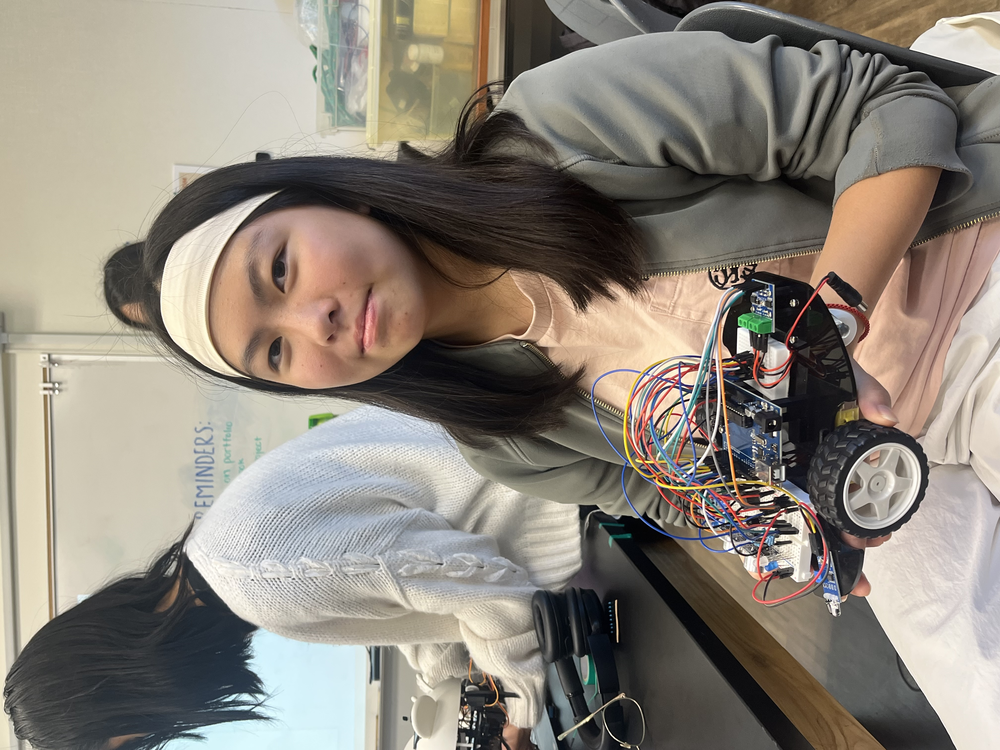

# Human Pestering Robot
This little robot I created can be driven via remote, has several obstacle avoidance systems, can follow objects, play a sound, and light up. Majority of these functions were added to make the robot appear approachable and enable it to midly irritate others. Ironically, I ran into many annoyances while designing and testing this robot.

| **Engineer** | **School** | **Area of Interest** | **Grade** |
|:--:|:--:|:--:|:--:|
| Alina F | Lynbrook High School | Still Exploring | Rising Sophomore

Meet the human pestering robot, R2-B2:





# Key Takeaways

During my time at BlueStamp, I expanded on my existing knowledge of the Arduino and circuit design. I had worked with sensors and components that I wasn't familar with. On top of that, I had to code in order for everything to work. Learning to code is something that I always despised and I certainly did not want to learn how to code just for this project. I ended up using Claude to write out the base code (since I am not familar with the format of coding) before making changes myself. Everytime a problem arose, my first instinct is to isolate certain variables and narrow down the issue (this method has served me well in this project). As for other skills I gained, I also learned to create schematics in Tinkercad and Fritzing (plus figuring out how to download Fritzing from Github). For the future, I hope to expand my knowledge of circuit components and familiarize myself with the art of problem solving.  
  
# Third Milestone

<iframe width="560" height="315" src="https://www.youtube.com/embed/ZbtA5DcNpWU?si=88WjiowESC8bPYQ6" title="YouTube video player" frameborder="0" allow="accelerometer; autoplay; clipboard-write; encrypted-media; gyroscope; picture-in-picture; web-share" referrerpolicy="strict-origin-when-cross-origin" allowfullscreen></iframe>


## Progress

In this third milestone, I added back the sensors that were previously removed (IR obstacle avoidance, HC-SR04 ultrasonic sensor, line tracking). I was debating about removing the line tracking module since it would open up more digital pins that I could use for other components (LEDs and piezo buzzer). I spent some time playing around with the layout of the LEDs before deciding I wanted to add two RGB LEDs. At first, I had them connected to the analog pins and gave them a code so that they will continously change color once turned on. The code has each hue choose randomly between 0 and 255. Occasionally, all the values land on 255 which results in the LED appearing off. I was considering altering the code so this doesn't happen, but decided against it since I was already satisfied with how it worked. Two white LEDs were added to function as the car's turn signals. When a button for the car to turn is pressed, the corresponding LED will be set to true and the other will be false. 

## Challenges

After wiring the sensors, I began to play around with each one individually before combining everything into one code. This phase consisted of many frustrations as the sensor would appear to not be working or detecting anything. I added in multiple serial printing functions so I could see if the sensor was detecting anything at all in the serial monitor. After that, I was trying to find out if the issue was in the software or hardware. For the IR obstacle avoidance modules, I had a software issue and adjusted the code so the sensor would get priority over the other functions in the car when the sensors were active. As for the ultrasonic module, I connected the ground and power wires into a different area on the breadboard to make the sensor work.

When it came to testing the robot using the combined code (this includes all the sensors and LEDs), the car would not be able to drive at all but I could hear the motors attempting to turn. Perhaps the motor controller was taking up too much power, so a seperate battery was added for the motor controller (this consisted of three AAA batteries) and I had the 9V battery replaced. This did allow the car to drive normally but the motor controller would overheat. The second battery was removed and the motor controller stopped overheating. Thankfully the car was still able to drive normally since the old 9V battery was replaced. 

### Adding the Shift Register

Unfortunately, the Arduino did not have enough digital pins for the next two components I wanted add: a passive piezo buzzer and a LED connected to pin 13 (the LED will light up everytime the IR reciever gets a signal from the remote). I began to research different components that would expand the number of digital pins available before settling on the 74HC595 shift register (which came with this kit). Since the half sized breadboard was already a bit crowded, I put the shift register on a mini breadboard instead. This way I could also avoid having to rearrange components on the half sized breadboard. The shift register requires connections to three digital pins on the Arduino and opens up eight more digital pins, but the pins on the shift register are not PWM pins nor input pins. I decided to rearrange the pin connections so I could have the two white LEDs and one RGB LED on the shift register and move one of the pins from the ultrasonic sensor to an analog pin along with the piezo buzzer. The three pins from the shift register are connect to pins 2, ~3, and 4. Moving the white LEDs also opened up pin 13, so I chose to connect two blue LEDs to that pin with LED feedback enabled. Now, when the IR receiver gets a signal, they will light up. For some reason, the pins on the shift register do not match their function (e.g. Q0 needs to be defined as 2 in order for the component to function). I spent time doing some trial and error in order to figure out which ones needed to be redefined for the components to work.

# Second Milestone

<iframe width="560" height="315" src="https://www.youtube.com/embed/7uoHsh0dZ4o?si=JFxf60nT4T1G4ZaD" title="YouTube video player" frameborder="0" allow="accelerometer; autoplay; clipboard-write; encrypted-media; gyroscope; picture-in-picture; web-share" referrerpolicy="strict-origin-when-cross-origin" allowfullscreen></iframe>


## Progress

In this milestone, the mini breadboard was removed in favor of using a half-sized breadboard to give myself more room for any components I may add in the future. I used velcro to attach the half-sized breadboard for easy relocation. Majority of the sensors and modules have been removed as I did not plan on using them (obstacle avoidance module, ultrasonic sensor, and line tracking module). As of right now, the only component on the breadboard is a 38kHz IR receiver. The receiver is able to detect IR signals from the remote and converts that into electrical commands. Receivers use photodiodes to absorb light along with a filter to ensure that only IR waves may pass through. For the wiring, one leg is wired to GND, another is wired to the 5V pin on the Arduino, and the last is wired to digital pin 12. The VCC pin from the motor controller is connected to the VCC leg on the receiver (and also the 5V pin). 
  
The code requires installation of the IRremote library. When a button is pressed on the remote, the receiver will detect which button is pressed and carry out the corresponding action. Movement functions set the four motor pins using PWM, with pin combinations that determine the wheels' direction of rotation, enabling the car to move foward, backward, left, right, and spin in place. A decoding function is used to convert the receiver's signals so it is easily readable and ignores any unrecongnized signals. 

## Challenges

The first issue I had encountered was my computer being unable to upload code to the Arduino (even though the correct board and port was selected). I tried swapping out USB cables, adapters, and ports but nothing had changed. Eventually, I decided to borrow another computer to upload code for the time being. After I went back and changed a few settings in the Arduino IDE, I was able to upload code. 

While testing the remote, I noticed that the robot had a tendency to drift right when it went forward or backward. A code for speed calibration was added so the wheels could spin at the same rate. The EEPROM library was added so the Arduino could preserve any speed calibrations when powered off. Since the left wheel was spinning faster than the right, the speed of the left wheel was reduced to 91% of the right wheel's speed. A helper function was added to keep the robot's speed between 0 and 255. 

# First Milestone

<iframe width="560" height="315" src="https://www.youtube.com/embed/BZBUk8scZYY?si=7nvxbyhpaTeg-iDW" title="YouTube video player" frameborder="0" allow="accelerometer; autoplay; clipboard-write; encrypted-media; gyroscope; picture-in-picture; web-share" referrerpolicy="strict-origin-when-cross-origin" allowfullscreen></iframe>


## Progress

The robot uses an acrylic plate as a base where the other parts will reside. On the top, an Arduino Uno is fastened using standoffs and screws, this will read inputs and translate them into outputs. A mini breadboard is attached anterior of the Arduino. The breadboard will be used to prototype, build, and test any circuits I plan on creating in the future. As of now, an ultrasonic sensor is attached to its front end and may be used to measure distance via echolocation (this can be used to automate the robot). Similarly, the two IR observance modules (these are screwed onto the left and right anterior ends of the acrylic plate on the topside) can function as proximity sensors by utilizing IR light. A line track module screwed to the bottom front side of the acrylic plate enables the car to navigate along a designated line. 
  
On the bottom of the acrylic plate, two motors are mounted with two TT wheels attached. Behind them is the universal wheel that has been mounted using standoffs and screws. The wheel is able to rotate 360º, providing the car with extra mobility and balance. Between the two motors is the 9V battery that has been attached using velcro. All the wires from the motors and battery's snap connector is threaded through a hole anterior of the universal wheel so they are easily accessible from the plate's topside. This way, the wires from the motor may be connected to the L9110 module (the car's motor controller) and the battery can be connected to the Arduino Uno. 

Basic wire setup for the car has also been completed in this milestone. The wires from the TT motors has been connected to the motor controller and is secured using screws. Jumper wires connect the pins from the motor controller to the Arduino, this will enable the wheels to rotate and move the car. Pins A-1B, A-1A, B-2A, and B-1A are connected to digital pins 5, 6, 9, and 10 respectively. These pins are responsible for the wheels' direction of rotation and thus, the direction the car drives in. 

## Choosing this Project

As for why I chose this project, I wanted to expand on my Arduino knowledge and familiarize myself with other circuit components. This project is relatively simple and did not require the use of hazardous tools, which meant that I have extra time and room to add my own modifications while staying safe. Plus, I could design this robot to pester my friends and family (this is the internal motivation for doing this project). 

# Starter Project

<iframe width="560" height="315" src="https://www.youtube.com/embed/pxxaiZzEqbY?si=YBfAkAmAtdKXfj1w" title="YouTube video player" frameborder="0" allow="accelerometer; autoplay; clipboard-write; encrypted-media; gyroscope; picture-in-picture; web-share" referrerpolicy="strict-origin-when-cross-origin" allowfullscreen></iframe>

The weevil eye uses a photoresistor (adjusts resistance inverse to the amount of light), a transistor, three resistors, and two LEDs. When less light is detected by the photoresistor, its resistance spikes and forces more current into the transistor. Once a threshold is met, power may flow and turn on the LEDs. A battery holder is present on the bottom of the weevil eye. 


# Schematics 

Note: The color coding on the schematic is to help distinguish the wires of different components and the colors may not match with the ones on the robot itself or on the different views of the circuit. Some wires are striped to help differentiate between wires of other components along with ground and power. Some parts could not be found in Fritzing so I used other componenets to mimic the wiring of the original part. A L293D motor driver was used to mimic the wire placement on the L9110 motor driver and a different type of passive piezo buzzer with three legs was used instead of a buzzer with only two legs.

Breadboard view:


Schematic view (not including the ground or power wiring):


# Code

Arduino IDE (version 2.3.10) was used to run the code.
```c++
#include <IRremote.h>
#include <EEPROM.h>

// IR receiver pin
const int IR_RECEIVE_PIN = 12; 

// motor pins
const int A_1B = 5;
const int A_1A = 6;
const int B_1B = 9;
const int B_1A = 10;

// 74HC595 shift register control pins
const int SR_DATA  = 3;  // SER = 14
const int SR_LATCH = 4;  // RCLK = 12
const int SR_CLOCK = 2;  // SRCLK = 11

// bit positions of each device on the shift register's output byte (Q0..Q7)
const byte SR_RIGHT_LED = 2;  // Q0 (acutal position, but defining it as 2 makes it work)
const byte SR_LEFT_LED  = 1;  // Q1 
const byte SR_RGB_R     = 4;  // Q3 (acutal position, but defining it as 4 makes it work) [2nd RGB - red]
const byte SR_RGB_G     = 5;  // Q4 (actual position, but defining it as 5 makes it work) [2nd RGB - green]
const byte SR_RGB_B     = 6;  // Q5 (actual position, but defining it as 6 makes it work) [2nd RGB - blue]

byte srState = 0;  // current state of all 8 shift register outputs

// direct Arduino pins for timing-critical devices
const int trigPin = A5;   
const int echoPin = 11;   
const int buzzerPin = A4; 

// IR obstacle avoidance modules pins
const int rightIR = 7;
const int leftIR = 8;

// 1st RGB LED remains on analog/PWM pins
#define LEDR A0
#define LEDG A1
#define LEDB A2

int speed = 150;
String flag = "NONE";

// calibration multipliers
float leftOffset = 1.0;
float rightOffset = 1.0;

// RGB state
bool rgbOn = false;              
unsigned long lastColorChange = 0;
const unsigned long holdTime = 500;  // ms to stay on each color before changing

int r, g, b, r2, g2, b2;

// buzzer state (continuous buzz, triggered by CYCLE)
int buzzerFreq = 1000;          // starting/default tone frequency in Hz
const int buzzerMinFreq = 100;  // setting boundaries for frequency
const int buzzerMaxFreq = 10000; 

bool buzzerOn = false;           // continuous buzz toggled by CYCLE, stopped by 0
bool buzzerState = false;        // current HIGH/LOW state
unsigned long lastBuzzerToggle = 0;  // micros() timestamp of last edge

// power lock state
// when locked, every button except power is ignored and all behaviors are frozen
bool locked = false;

const int DEFAULT_SPEED = 150;  // speed to reset to on every power press

// R2D2 sound engine is non-blocking, no tone() used anywhere
// calling tone() knocks IR remote's timer out of sync and the remote stops responding
// generating the waveform manually (digitalWrite toggling, same trick as updateBuzzer()) avoids touching Timer2
enum R2D2EventType { R2D2_SWEEP, R2D2_STACCATO, R2D2_PAUSE, R2D2_GROAN };

struct R2D2Event {
  R2D2EventType type;
  int startFreq;          // starting frequency (Hz) for SWEEP/GROAN/STACCATO
  int endFreq;             // target frequency (Hz) for SWEEP/GROAN
  int stepIntervalMs;      // how often to advance frequency for SWEEP/GROAN
  int freqStep;            // amount to change frequency per step (+ for sweep, - for groan)
  unsigned long durationMs; // total duration for STACCATO/PAUSE
};

const int R2D2_MAX_EVENTS = 16;
R2D2Event r2d2Sequence[R2D2_MAX_EVENTS];
int r2d2EventCount = 0;
int r2d2CurrentEvent = -1;    // -1 = no sequence running
bool r2d2Active = false;
bool r2d2WasBuzzing = false;  // remembers if continuous buzzer was on before we borrowed the pin

unsigned long r2d2EventStartMs = 0;
unsigned long r2d2LastFreqStepMs = 0;
int r2d2CurrentFreq = 0;
bool r2d2ToneState = false;
unsigned long r2d2LastToggleUs = 0;

void setup() {
  Serial.begin(9600);

  // motor setup
  pinMode(A_1B, OUTPUT);
  pinMode(A_1A, OUTPUT);
  pinMode(B_1B, OUTPUT);
  pinMode(B_1A, OUTPUT);

  // shift register control pins setup
  pinMode(SR_DATA, OUTPUT);
  pinMode(SR_LATCH, OUTPUT);
  pinMode(SR_CLOCK, OUTPUT);
  srState = 0;
  srUpdate();  // turn all SR outputs off initially

  // direct physical pins setup (ultrasonic and buzzer)
  pinMode(trigPin, OUTPUT); 
  pinMode(echoPin, INPUT);
  pinMode(buzzerPin, OUTPUT);
  digitalWrite(buzzerPin, LOW);

  // IR obstacle setup
  pinMode(leftIR, INPUT);
  pinMode(rightIR, INPUT);

  // 1st RGB LED setup
  pinMode(LEDR, OUTPUT);
  pinMode(LEDG, OUTPUT);
  pinMode(LEDB, OUTPUT);
  
  setRGB(0, 0, 0, 0, 0, 0);  // start off

  randomSeed(analogRead(A2) + micros()); // read from unused A2 for random seed

  // drift correction
  int leftEEPROM = EEPROM.read(0);
  int rightEEPROM = EEPROM.read(1);

  if (leftEEPROM == 255 || leftEEPROM == 100) leftEEPROM = 88;  // left wheel spinning faster than right
  if (rightEEPROM == 255 || rightEEPROM == 100) rightEEPROM = 100;

  // convert integers
  leftOffset = leftEEPROM * 0.01;
  rightOffset = rightEEPROM * 0.01;

  // IR remote start
  IrReceiver.begin(IR_RECEIVE_PIN, ENABLE_LED_FEEDBACK);  
  Serial.println("REMOTE CONTROL START");
}

// buttons
void loop() {
  if (IrReceiver.decode()) {
    String key = decodeKeyValue(IrReceiver.decodedIRData.command);
    if (key != "ERROR") {
      Serial.println(key);

      if (key == "POWER") {
        // power always works, even while locked 
        // every press wipes any previously running command
        resetAllSystems();
        locked = !locked;
        Serial.println(locked ? "LOCKED" : "UNLOCKED");
      } else if (locked) {
        // ignore every other button while locked
        Serial.println("LOCKED - ignoring input");
      } else if (key == "+") {
        speed += 25;
        Serial.println(speed);
      } else if (key == "-") {
        speed -= 25;
        Serial.println(speed);
      } else if (key == "5") {
        rgbOn = !rgbOn;              // toggle RGB LEDs
        if (rgbOn) {
          lastColorChange = millis();
          randomizeColors();
          setRGB(r, g, b, r2, g2, b2);
        } else {
          setRGB(0, 0, 0, 0, 0, 0);  // turn both off
        }
      } else if (key == "2") {
        moveForward(speed);
        delayWithBuzzer(1000);
      } else if (key == "1") {
        moveLeft(speed);
        setLEDs(true, false);
      } else if (key == "3") {
        moveRight(speed);
        setLEDs(false, true);
      } else if (key == "4") {
        turnLeft(speed);
        setLEDs(true, false);
      } else if (key == "6") {
        turnRight(speed);
        setLEDs(false, true);
      } else if (key == "7") {
        backLeft(speed);
        setLEDs(true, false);
      } else if (key == "9") {
        backRight(speed);
        setLEDs(false, true);
      } else if (key == "8") {
        moveBackward(speed);
        delayWithBuzzer(750);
      } else if (key == "U/SD") {
        flag = "AUTO";
      } else if (key == "0") {
        flag = "NONE";
        stopMove();
        stopBuzzer();   // 0 silences continuous buzzer
      } else if (key == "FORWARD") {
        flag = "ULTR";
      } else if (key == "BACKWARD") {
        flag = "IROB";
      } else if (key == "EQ") {
        flag = "FOLW";
      } else if (key == "CYCLE") {
        startBuzzer();   
      } else if (key == "MODE") {
        buzzerFreq += 500;
        buzzerFreq = constrain(buzzerFreq, buzzerMinFreq, buzzerMaxFreq);
        Serial.print("Buzzer freq: "); Serial.println(buzzerFreq);
      } else if (key == "MUTE") {
        buzzerFreq -= 500;
        buzzerFreq = constrain(buzzerFreq, buzzerMinFreq, buzzerMaxFreq);
        Serial.print("Buzzer freq: "); Serial.println(buzzerFreq);
      } else if (key == "PLAY/PAUSE") {
        startR2D2Sequence();   // non-blocking now - kicks off the sound state machine
      }

      if (!locked) {
        speed = constrain(speed, 0, 255);
        delayWithBuzzer(500);
        stopMove();
        setLEDs(false, false);  // turn off white indicator LEDs once move ends
      }
    }
    IrReceiver.resume();  
  }

  if (!locked) {
    if (flag == "AUTO") {
      AutoDrive(speed);
    } else if (flag == "ULTR") {
      ultrasonicExample(speed);
    } else if (flag == "IROB") {
      irobstacleExample(speed);
    } else if (flag == "FOLW") {
      following(speed);
    }

    // non-blocking RGB color cycling while active
    if (rgbOn && (millis() - lastColorChange >= holdTime)) {
      lastColorChange = millis();
      randomizeColors();
      setRGB(r, g, b, r2, g2, b2);
    }
  }

  // non-blocking buzzer tone using the direct pin
  // left running unconditionally: buzzerOn/r2d2Active are already forced false
  // the instant we lock, so these are harmless no-ops while locked
  updateBuzzer();

  // non-blocking R2D2 sound effect (if a sequence is currently playing)
  updateR2D2();
}

// locking
// wipes out any command/behavior currently in progress and returns every  subsystem to a known, idle default
void resetAllSystems() {
  flag = "NONE";              // cancel AUTO/ULTR/IROB/FOLW modes
  speed = DEFAULT_SPEED;      // reset speed back to default

  stopMove();                 // motors off
  setLEDs(false, false);      // white indicator LEDs off

  stopBuzzer();                // continuous CYCLE buzzer off
  r2d2Active = false;          // cancel any in-progress R2D2 chatter
  r2d2CurrentEvent = -1;
  r2d2EventCount = 0;
  r2d2WasBuzzing = false;
  digitalWrite(buzzerPin, LOW); // make sure the pin is left LOW either way

  rgbOn = false;                // stop RGB color cycling
  setRGB(0, 0, 0, 0, 0, 0);     // both RGB LEDs off
}

// shift register helpers
void srUpdate() {
  digitalWrite(SR_LATCH, LOW);
  shiftOut(SR_DATA, SR_CLOCK, MSBFIRST, srState);
  digitalWrite(SR_LATCH, HIGH);
}

void srWrite(byte bitPos, bool state) {
  if (state) {
    srState |= (1 << bitPos);
  } else {
    srState &= ~(1 << bitPos);
  }
  srUpdate();
}

// ultrasonic readings
float readSensorData() {
  // directly trigger physical pin A0
  digitalWrite(trigPin, LOW);
  delayMicroseconds(2);
  digitalWrite(trigPin, HIGH);
  delayMicroseconds(10);
  digitalWrite(trigPin, LOW);
  
  // measure return echo with a 30ms timeout so it doesn't hang the loop
  float distance = pulseIn(echoPin, HIGH, 30000) / 58.00;  
  return distance;
}

// picks new random colors for RGB LEDs
void randomizeColors() {
  r = random(0, 255);
  g = random(0, 255);
  b = random(0, 255);

  r2 = random(0, 255);
  g2 = random(0, 255);
  b2 = random(0, 255);
}

void setRGB(int r2v, int g2v, int b2v, int rv, int gv, int bv) {
  // 2nd RGB is connected to shift register bits (Digital ON/OFF only)
  srWrite(SR_RGB_R, r2v > 127);
  srWrite(SR_RGB_G, g2v > 127);
  srWrite(SR_RGB_B, b2v > 127);

  // 1st RGB remains full-color on direct pins
  analogWrite(LEDR, rv);
  analogWrite(LEDG, gv);
  analogWrite(LEDB, bv);
}

void setLEDs(bool leftOn, bool rightOn) {
  srWrite(SR_LEFT_LED, leftOn);
  srWrite(SR_RIGHT_LED, rightOn);
}

// buzzer control (continuous CYCLE buzzer)
void startBuzzer() {
  buzzerOn = true;
  buzzerState = true;
  lastBuzzerToggle = micros();
  digitalWrite(buzzerPin, HIGH);
}

// stops the continuous buzzer and makes sure the pin is left LOW
void stopBuzzer() {
  buzzerOn = false;
  buzzerState = false;
  digitalWrite(buzzerPin, LOW);
}

// checks whether it's time to flip the buzzer pin
// pulled out of loop() so it can also be called from delayWithBuzzer()
// while a blocking-style delay is "waiting", this is what lets the buzzer keep sounding even when a button is pressed
void updateBuzzer() {
  if (buzzerOn) {
    unsigned long halfPeriodUs = 500000UL / (unsigned long)buzzerFreq; 
    if (micros() - lastBuzzerToggle >= halfPeriodUs) {
      lastBuzzerToggle = micros();
      buzzerState = !buzzerState;
      digitalWrite(buzzerPin, buzzerState); 
    }
  }
}

// drop-in replacement for delay(ms) ƒor the buzzer the R2D2 sounds while time passes, instead of freezing everything
void delayWithBuzzer(unsigned long ms) {
  unsigned long start = millis();
  while (millis() - start < ms) {
    updateBuzzer();
    updateR2D2();
  }
}

// R2D2 sounds
// builds one "chirp" event (either an upward pitch sweep or a quick staccato tone)
void addR2D2Chirp() {
  if (r2d2EventCount >= R2D2_MAX_EVENTS) return;
  int noteType = random(0, 2);

  if (noteType == 0) {
    // upward pitch sweep (excited/questioning)
    int startFreq = random(1000, 2000);
    int endFreq = startFreq + random(400, 1000);
    r2d2Sequence[r2d2EventCount++] = { R2D2_SWEEP, startFreq, endFreq, 2, 40, 0 };
  } else {
    // quick steady tone
    int freq = random(800, 2500);
    int duration = random(40, 100);
    r2d2Sequence[r2d2EventCount++] = { R2D2_STACCATO, freq, freq, 0, 0, (unsigned long)duration };
  }
}

// builds the low descending "sad groan" event
void addR2D2Groan() {
  if (r2d2EventCount >= R2D2_MAX_EVENTS) return;
  r2d2Sequence[r2d2EventCount++] = { R2D2_GROAN, 700, 250, 4, -5, 0 };
}

// builds a random chatter sequence (chooses between excited and steady for each chrip)
// (3-6 chirps + short gaps) followed by a groan, then lets updateR2D2() play it back a little at a time on every loop() iteration
// updateR2D2() is called every loop and is inside delayWithBuzzer() so it can continue even when the car is driving
void startR2D2Sequence() {
  // if the continuous buzzer was running, pause it and hand the pin over
  // restored automatically once the sequence finishes
  r2d2WasBuzzing = buzzerOn;
  if (r2d2WasBuzzing) stopBuzzer();

  r2d2EventCount = 0;
  int chatterCount = random(3, 7);
  for (int i = 0; i < chatterCount; i++) {
    addR2D2Chirp();
    if (r2d2EventCount < R2D2_MAX_EVENTS) {
      r2d2Sequence[r2d2EventCount++] = { R2D2_PAUSE, 0, 0, 0, 0, (unsigned long)random(50, 150) };
    }
  }
  if (r2d2EventCount < R2D2_MAX_EVENTS) {
    r2d2Sequence[r2d2EventCount++] = { R2D2_PAUSE, 0, 0, 0, 0, 300 }; // pause before the groan
  }
  addR2D2Groan();

  r2d2CurrentEvent = 0;
  r2d2Active = true;
  r2d2BeginCurrentEvent();
}

// resets the per-event timers whenever it moves on to a new event in the sequence
void r2d2BeginCurrentEvent() {
  R2D2Event &e = r2d2Sequence[r2d2CurrentEvent];
  r2d2EventStartMs = millis();
  r2d2LastFreqStepMs = r2d2EventStartMs;
  r2d2LastToggleUs = micros();
  r2d2ToneState = false;
  digitalWrite(buzzerPin, LOW);
  r2d2CurrentFreq = e.startFreq;
}

// moves to the next event in the sequence or ends the sequence and restores the continuous buzzer if it was interrupted
void r2d2AdvanceEvent() {
  r2d2CurrentEvent++;
  if (r2d2CurrentEvent >= r2d2EventCount) {
    r2d2Active = false;
    r2d2CurrentEvent = -1;
    digitalWrite(buzzerPin, LOW);
    if (r2d2WasBuzzing) startBuzzer();
    return;
  }
  r2d2BeginCurrentEvent();
}

// advances whichever R2D2 event is currently playing by a tiny amount each time it's called; safe (and required) to call every loop() iteration
void updateR2D2() {
  if (!r2d2Active || r2d2CurrentEvent == -1) return;

  R2D2Event &e = r2d2Sequence[r2d2CurrentEvent];
  unsigned long nowMs = millis();

  switch (e.type) {
    case R2D2_PAUSE:
      digitalWrite(buzzerPin, LOW);
      if (nowMs - r2d2EventStartMs >= e.durationMs) r2d2AdvanceEvent();
      break;

    case R2D2_STACCATO: {
      if (nowMs - r2d2EventStartMs >= e.durationMs) {
        digitalWrite(buzzerPin, LOW);
        r2d2AdvanceEvent();
        break;
      }
      unsigned long halfPeriodUs = 500000UL / (unsigned long)e.startFreq;
      if (micros() - r2d2LastToggleUs >= halfPeriodUs) {
        r2d2LastToggleUs = micros();
        r2d2ToneState = !r2d2ToneState;
        digitalWrite(buzzerPin, r2d2ToneState);
      }
      break;
    }

    case R2D2_SWEEP:
    case R2D2_GROAN: {
      bool ascending = (e.freqStep > 0);
      bool doneSweep = ascending ? (r2d2CurrentFreq >= e.endFreq) : (r2d2CurrentFreq <= e.endFreq);
      if (doneSweep) {
        digitalWrite(buzzerPin, LOW);
        r2d2AdvanceEvent();
        break;
      }
      if (nowMs - r2d2LastFreqStepMs >= (unsigned long)e.stepIntervalMs) {
        r2d2LastFreqStepMs = nowMs;
        r2d2CurrentFreq += e.freqStep;
      }
      unsigned long halfPeriodUs = 500000UL / (unsigned long)r2d2CurrentFreq;
      if (micros() - r2d2LastToggleUs >= halfPeriodUs) {
        r2d2LastToggleUs = micros();
        r2d2ToneState = !r2d2ToneState;
        digitalWrite(buzzerPin, r2d2ToneState);
      }
      break;
    }
  }
}

// helper function to keep calibrated speeds between 0 and 255
int calculateSpeed(int targetSpeed, float offset) {
  int finalSpeed = int(targetSpeed * offset);
  return constrain(finalSpeed, 0, 255);
}

// direction of wheel rotation, direction of car
void moveForward(int speed) {
  analogWrite(A_1B, 0);
  analogWrite(A_1A, calculateSpeed(speed, rightOffset));
  analogWrite(B_1B, calculateSpeed(speed, leftOffset));
  analogWrite(B_1A, 0);
}

void moveBackward(int speed) {
  analogWrite(A_1B, calculateSpeed(speed, rightOffset));
  analogWrite(A_1A, 0);
  analogWrite(B_1B, 0);
  analogWrite(B_1A, calculateSpeed(speed, leftOffset));
}

void turnRight(int speed) {
  analogWrite(A_1B, calculateSpeed(speed, rightOffset));
  analogWrite(A_1A, 0);
  analogWrite(B_1B, calculateSpeed(speed, leftOffset));
  analogWrite(B_1A, 0);
}

void turnLeft(int speed) {
  analogWrite(A_1B, 0);
  analogWrite(A_1A, calculateSpeed(speed, rightOffset));
  analogWrite(B_1B, 0);
  analogWrite(B_1A, calculateSpeed(speed, leftOffset));
}

void moveLeft(int speed) {
  analogWrite(A_1B, 0);
  analogWrite(A_1A, calculateSpeed(speed, rightOffset));
  analogWrite(B_1B, 0);
  analogWrite(B_1A, 0);
}

void moveRight(int speed) {
  analogWrite(A_1B, 0);
  analogWrite(A_1A, 0);
  analogWrite(B_1B, calculateSpeed(speed, leftOffset));
  analogWrite(B_1A, 0);
}

void backLeft(int speed) {
  analogWrite(A_1B, calculateSpeed(speed, rightOffset));
  analogWrite(A_1A, 0);
  analogWrite(B_1B, 0);
  analogWrite(B_1A, 0);
}

void backRight(int speed) {
  analogWrite(A_1B, 0);
  analogWrite(A_1A, 0);
  analogWrite(B_1B, 0);
  analogWrite(B_1A, calculateSpeed(speed, leftOffset));
}

// left wheel slower / faster than right wheel -> curves the car left while still moving forward
void steerLeft(int fast, int slow) {
  // right wheel forward (slow), left wheel backward (fast) -> rotate CCW
  analogWrite(A_1B, 0);
  analogWrite(A_1A, slow);
  analogWrite(B_1B, 0);
  analogWrite(B_1A, fast);
}

void steerRight(int fast, int slow) {
  // left wheel forward (slow), right wheel backward (fast) -> rotate CW
  analogWrite(A_1B, fast);
  analogWrite(A_1A, 0);
  analogWrite(B_1B, slow);
  analogWrite(B_1A, 0);
}

void stopMove() {
  analogWrite(A_1B, 0);
  analogWrite(A_1A, 0);
  analogWrite(B_1B, 0);
  analogWrite(B_1A, 0);
}

// self driving
void AutoDrive(int speed) {
  int left = digitalRead(leftIR);  // 0: Obstructed   1: Empty
  int right = digitalRead(rightIR);

  if (!left && right) {
    backLeft(speed);
  } else if (left && !right) {
    backRight(speed);
  } else if (!left && !right) {
    moveBackward(speed);
  } else {
    float distance = readSensorData();
    Serial.println(distance);
    if (distance > 15) {  // safe
      moveForward(150);
    } else if (distance < 8 && distance > 2) {  // move away
      moveBackward(150);
      delayWithBuzzer(1000);
      backLeft(150);
      delayWithBuzzer(500);
    } else {
      moveForward(150);
    }
  }
}

// follow object
// uses the ultrasonic sensor to gauge distance to the object and the two IR obstacle sensors to steer toward it
void following(int speed) {
  float distance = readSensorData();
  int left = digitalRead(leftIR);   // 0: Obstructed  1: Empty
  int right = digitalRead(rightIR);
  int turnSpeed = 150;

  Serial.print("dist: "); Serial.print(distance);
  Serial.print(" L: "); Serial.print(left);
  Serial.print(" R: "); Serial.println(right);

  if (distance > 15) {
    // nothing in front, use IR to steer toward it
    if (!left && right) {
      steerLeft(speed, turnSpeed);
    } else if (left && !right) {
      steerRight(speed, turnSpeed);
    } else {
      stopMove();
    }
  } else if (distance > 8) { // too close, stop
    moveForward(speed);
  } else {
    stopMove(); 
  }
}

bool obstacleDetected() {
  int left = digitalRead(leftIR);   // 0: Obstructed   1: Empty
  int right = digitalRead(rightIR);
  return (!left || !right);
}
// IR obstacle avoidance
void irobstacleExample(int speed) {
  if (obstacleDetected()) {
    stopMove();
    Serial.println("OBSTACLE DETECTED - STOPPED");
  } else {
    moveForward(speed);
  }
}
// ultrasonic sensor
void ultrasonicExample(int speed) {
  float distance = readSensorData();
  Serial.println(distance);
  if (distance > 15) {
    moveForward(speed);
  } else if (distance < 8 && distance > 2) {
    moveBackward(speed);
  } else {
    stopMove();
  }
}

// translate signal from IR receiver so it can be easily read 
String decodeKeyValue(long result) {
  switch(result){
    case 0x16: return "0";
    case 0xC:  return "1"; 
    case 0x18: return "2"; 
    case 0x5E: return "3"; 
    case 0x8:  return "4"; 
    case 0x1C: return "5"; 
    case 0x5A: return "6"; 
    case 0x42: return "7"; 
    case 0x52: return "8"; 
    case 0x4A: return "9"; 
    case 0x9:  return "+"; 
    case 0x15: return "-"; 
    case 0x7:  return "EQ"; 
    case 0xD:  return "U/SD";
    case 0x19: return "CYCLE";         
    case 0x44: return "PLAY/PAUSE";   
    case 0x43: return "FORWARD";   
    case 0x40: return "BACKWARD";   
    case 0x45: return "POWER";   
    case 0x47: return "MUTE";   
    case 0x46: return "MODE";       
    case 0x0:  return "ERROR";   
    default :  return "ERROR";
  }
}

```

# Remote Control

Below is the layout of the IR remote used for this robot. I included the names of each button based on their names in the code along with their function.

| | | |
| :--- | :---: | ---: |
| **Power** (lock all other buttons)| **Mode** (+500Hz for buzzer) | **Mute** (-500Hz for buzzer) |
| **Play/Pause** (play R2D2 sounds) | **Backward** (enable IR obstacle avoidance mode) | **Forward** (enable ultrasonic sensor distance detection mode) |
| **EQ** (follow an object mode) | **Minus** (-25 speed) | **Plus** (+25 speed) |
| **0** (stop/reset any non-numbered commands) | **Cycle** (play buzzer) | **U/SD** (self-driving mode) |
| **1** (turn left front) | **2** (drive forward) | **3** (turn right front) |
| **4** (rotate counter clockwise) | **5** (enable RGB LED) | **6** (rotate clockwise) |
| **7** (turn left back) | **8** (drive backward) | **9** (turn right back) |
| | | |

**Side notes:**
 - Pressing "POWER" once will lock all other buttons, pressing it again will unlock
     - Pressing "POWER" will also terminate any already running commands
     - Check the number of times the blue LEDs light up
     - They should only flash once
     - If they flash more than one time then that button press was registered as two button presses
 - Pressing "+" too many times will not cause the car greatly increase in speed
     - Speed is capped at 255
     - Car will not be able to drive once speed is at 100 or lower
 - If "PLAY/PAUSE" is pressed while "CYCLE" is running, the R2D2 sound will play
     - Buzzer sound will resume once R2D2 sound is completed
     - Same logic is true for "MUTE" and "MODE"
 - Buttons may be held down while pressed to run a command continously for the driving functions
 - For other buttons it will cause the function to switch on and off rapidly
 - Passive piezo buzzer's frequency is limited to between 100Hz and 10000Hz
 - Blue LED lights will flash to indicate a remote press is being registered
 - Most universal MP3 IR remotes with 21 keys should work for the robot
 - If more than one mode is enabled at once, the car may not drive
     - "0" may be pressed to reset the car for commands to proceed
 - Avoid spamming different buttons that might cause the car's commands to clash or contradict

# Bill of Materials
The 3 in 1 kit from SunFounder includes most of the parts used in this project. Parts that came with the kit will not have their price nor their link listed while parts not included in the kit will have both the price and link listed.

| **Part** | **Amount Used** | **Note** | **Price** | **Link** |
|:--:|:--:|:--:|:--:|:--:|
| 3 in 1 kit | 1 | kit includes majority of the materials used to build the car | $69.99 | <a href="https://www.sunfounder.com/products/sunfounder-3-in-1-iot-smart-car-learning-ultimate-starter-kit"> Link </a> |
| acrylic plate | 1 | main body for components to reside on, structural support |  |  |
| Arduino Uno R3 | 1 | reads inputs, proccess data according to code, control outputs  |  |  |
| 9V battery| 1 | power supply |  |  |
| 9V battery cable | 1 | connects battery to the Arduino |  |  |
| L9110 motor driver | 1 | control speed and direction of motors |  |  |
| TT motor | 2 | convert electrical energy into mechanical energy to drive wheels |  |  |
| TT wheel | 2 | rotates to drive the car |  |  |
| 1" universal wheel | 1 | third wheel for balance, can rotate 360º |  |  |
| IR remote control | 1 | operates the car and sends binary code to a receiver |  |  |
| IR receiver | 1 | receives the signal from the remote |  |  |
| half sized breadboard | 1 | most components reside here | $6.99 | <a href="https://www.amazon.com/Arduino-A000066-ARDUINO-UNO-R3/dp/B008GRTSV6/](https://www.amazon.com/DEYUE-breadboard-Set-Prototype-Board/dp/B07LFD4LT6/ref=sr_1_5?channelId=500&clpRedir=Y&dib=eyJ2IjoiMSJ9.OVjKxIeCVYNU10JQfr5F6xG-vHw-BjGUMjXarhDZV6SfhzbbpyaLfDx_YoTfuRBtDvoFgI-O5RlwoAqxruW54kUgKCosnFw5PookczumSEHN2fcG7ZeMO9YrkjcHO3aWHbNMuQi7pYNXyFRjS53Y4_u7lJ-aOkHyATjjMtCrb6KcX259wK7Mi7Ga6uZtbhsHRciS18MbzilPQVByR2iMDUFpIh1_X7u-zzdJBs1TWPc.B_gI1SvrzH61RVDUf6cZuoKmMHZL_0IK8kogO8hVMtQ&dib_tag=se&keywords=half+size+breadboard&plpRedirect=mhFallback&qid=1784306456&sr=8-5"> Link </a> |
| mini breadboard | 1 | extra space for wiring components |  |  |
| RGB LED | 2 | switches colors while lighting up, decorative purposes | $8.99 | <a href="https://www.amazon.com/EDGELEC-Tri-Color-Multicolor-Diffused-Resistors/dp/B077XGF3YR/ref=sr_1_3?channelId=500&clpRedir=Y&dib=eyJ2IjoiMSJ9.BU4S0jVgvYFMaG3YX-8kvy2xEtIibcREs2Owe4pu8svyOM3ehUqVvSHt-sFyBsmkBMaGC6Uhf6J-7nHvDBNUjJ-ewEEmlnBGY0Esf2tksDMXRcH7JOQWpuymyKSwyCoBVNRiUFmKrw2g4wmVlvbNRl4lZV5sBrx12FNHWpruY-rORlUMc2JnJ3vSiGQ9fvvNqMRtwxPXCC2YcUfRZtMZZT_4tsFLBs_Y4XGW_AKSsBE.vvlrNAq1Et4AUnl-VssLzH9y_bMpm10NB2Ykm0r7l9g&dib_tag=se&keywords=rgb%2Bled&plpRedirect=mhFallback&qid=1784572999&sr=8-3&th=1"> Link </a> |
| blue LED | 2 | connected to pin 13, flashes when IR receiver gets a signal |  |  |
| white LED | 2 | behaves similar to a car's turn signals |  |  |
| ultrasonic sensor (HC-SR04) | 1 | detects distance via echolocation |  |  |
| IR obstacle avoidance module | 2 | detects nearby objects by emitting and receiving IR light |  |  |
| passive piezo buzzer | 1 | produces sound and is able to change pitch |  |  |
| shift register (74HC595) | 1 | expands number of digital output pins |  |  |
| resistors (330Ω, 1kΩ, 2kΩ, 5kΩ) | 2, 4, 2, 2 respectively  | prevent components from getting damaged |  |  |
| jumper wires (M-M & F-M) | 20 & 12 respectively | create electrical connections |  |  |
| screws (M3x6mm & M2.5x6mm)  | 22 & 8 respectively | fasten components |  |  |
| nuts (M3) | 6 | fasten components |  |  |
| standoffs (M3x24mm, M3x12mm, M2.5x11mm) | 4 each | elevate certain components |  |  |
| velcro (1 in strip) | 2 | attach components while allowing for easy removal |  |  |
| screw driver | 1 | screwing in screws, adjusting potentiometers |  |  |
| USB-A to USB-B cable | 1 | connect Arduino to computer |  |  |
| USB-B to USB-C adapter | 1 | connect the cable to computer port | $6.99 | <a href="https://www.amazon.com/Syntech-Adapter-Thunderbolt-Compatible-MacBook/dp/B07CVX3516/ref=sr_1_3?channelId=500&clpRedir=Y&dib=eyJ2IjoiMSJ9.d7LKMhCLqwSoIHvDHsmfNNASCcVrrSwIS4h1KNDXWaRlfv0Af9ia70iXoIl6q9XTGAAwQLY_Mqrql2JI0XznGBRShN8fWvmudbknWJjx-Cap4A_2fsLNIYGaT3qJ5T9uXpjI_nG7pi_OTwSYGeLWBtEhwgsFeNQeNk24qXI_nkghOiFOH-1DVKolZwrI3KQOInaAGnf8V-C1FKPEwEY_bQyMn8Fk7zb5oI00bNkg9fk.HC8ik8XHZQiflxFCElxXHv1JYhxPqz-lKOqaUxmfI1k&dib_tag=se&keywords=usb%2Bb%2Bto%2Busb%2Bc%2Badapter&plpRedirect=mhFallback&qid=1784572867&sr=8-3&th=1"> Link </a> |

# Photos

Front view:


Back view:


Side view (right):


Side view (left):


Top view:


Bottom view:


# Resources/References

[Sunfounder's Instructions](https://docs.sunfounder.com/projects/3in1-kit-v2/en/latest/car_project/car_assemble.html)

[Learn About Arduino](https://docs.arduino.cc/learn/)

[74HC959 Shift Register](https://learn.adafruit.com/74hc595)

[RGB LED in Tinkercad](https://www.tinkercad.com/things/fMiUiPWqtO9-rgb-led)

[L9110 Motor Driver](https://docs.sunfounder.com/projects/3in1-kit-v2/en/latest/components/component_l9110_module.html)

[Passive Piezo Buzzer](https://uk.rs-online.com/web/content/discovery/ideas-and-advice/how-do-piezo-buzzers-work)

[Ultrasonic Sensor (HC-SR04)](https://docs.sunfounder.com/projects/ultimate-sensor-kit/en/latest/components_basic/01-component_ultrasonic_module.html)

[IR Obstacle Avoidance Module](https://docs.sunfounder.com/projects/ultimate-sensor-kit/en/latest/components_basic/09-component_ir_obstacle.html)

[IR Receiver](https://www.electronicsforu.com/technology-trends/learn-electronics/ir-led-infrared-sensor-basics)

[Project Notebook](https://docs.google.com/document/d/1CKAgA1Z3KnM4e_xub-k0-8ildSCVjZ5tO_CuyvIDajk/edit?tab=t.0)
